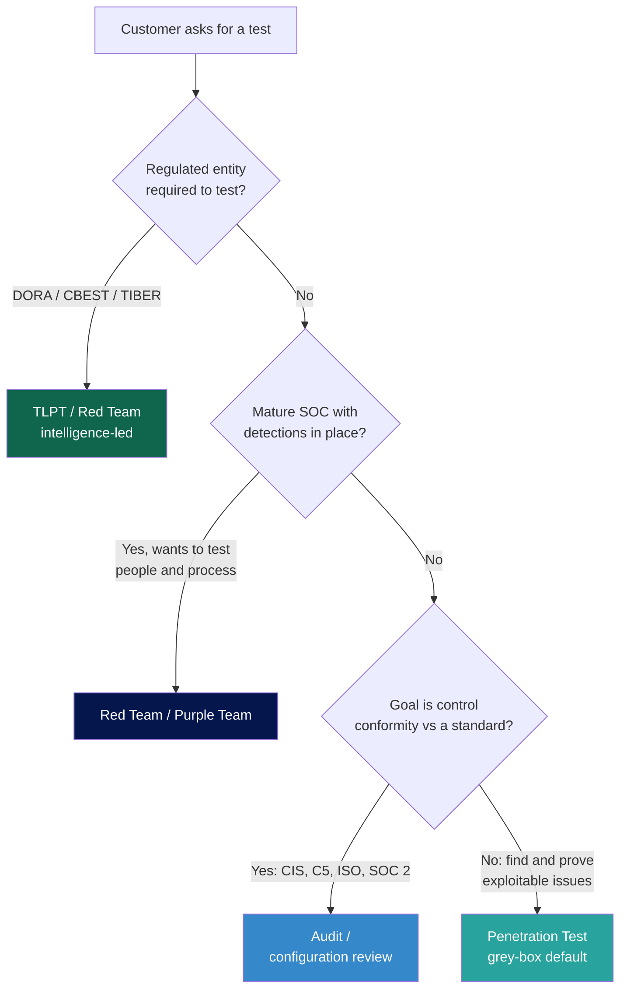
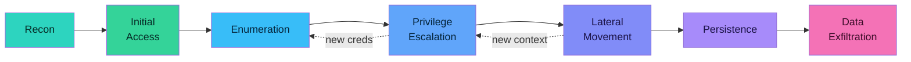

# 00 — Methodology

How to scope, run, and report a cloud engagement. Three modes, one structure.

The three modes differ in **goal**, **information given to the tester**, **detection awareness**, and **what success looks like**:

| | Pentest | Red Team / TLPT | Audit |
|---|---|---|---|
| **Goal** | Find vulns in defined scope | Test detection & response against a realistic adversary | Verify controls match a standard |
| **Knowledge** | Grey-box (creds + docs) typically | Black-box, threat-intel-driven | White-box (read-only IAM across the estate) |
| **Defenders aware?** | Usually yes | No (only White Team) | Yes |
| **Coverage** | Breadth | Depth on a few paths | Breadth, checklist-driven |
| **Output** | Finding list + risk | Attack narrative + detection gaps | Control matrix + deviations |

You pick the mode based on what the customer actually wants. A board that asks for "a pentest" often wants an audit. A bank under DORA asking for a "pentest" almost always means TLPT.

### Which mode? (decision tree)

---

## 1. Pentest scoping

### What you need before quoting

- **Target accounts / subscriptions / projects.** Account ID, subscription GUID, project ID. Not "our AWS." Multiple? List them. Production vs sandbox?
- **Services in scope.** Compute, storage, IAM, databases, K8s, serverless, SaaS-layer (M365 / Workspace).
- **Network reachability.** Internal-only? VPN-required? Public endpoints?
- **Identity model.** Federated (Entra ID → AWS, Workspace → GCP)? Local IAM users? SSO via Okta/Ping?
- **Detection landscape.** GuardDuty / Defender for Cloud / Security Command Center on? SIEM? SOC 24/7?
- **Test type.** Black, grey, or white box. Grey is the realistic default.
- **Credentials provided.** Either: a low-priv IAM user, a leaked-secret simulation, or an "assumed breach" set of access keys.
- **Time window.** Working hours only? After hours? Detection-impact ok?
- **Out-of-scope.** Document explicitly. Common: customer-impacting DoS, social engineering of staff, third-party SaaS the customer doesn't own.
- **Provider rules.** AWS, Azure, and GCP each publish customer testing policies — see `01-standards-and-regulations/sector-mapping.md` for the current state.

### Effort estimation (rough)

These are working-hour estimates for grey-box engagements, single platform. Adjust upward for multi-account environments and downward for tightly scoped engagements.

| Environment size | AWS | Azure | GCP |
|---|---|---|---|
| Small (1 account, < 20 services) | 5-8 PD | 6-9 PD | 5-8 PD |
| Medium (3-5 accounts, hybrid IAM) | 10-15 PD | 12-18 PD | 10-15 PD |
| Large (org-wide, multi-region) | 20-30 PD | 25-35 PD | 20-30 PD |

Azure runs longer because of Entra ID + hybrid identity surface area. PD = person-day.

### Deliverables

Final report, executive summary, finding table with severity (CVSS or risk-rated), evidence (request/response, screenshots, IAM policy excerpts), and remediation. Optional retest after fixes.

---

## 2. Red team / TLPT scoping

### When this is the right mode

- Mature customer with SOC and detections already in place.
- Regulated entity required to do it (DORA Art. 26–27, US FFIEC CAT, UK CBEST, HK iCAST, ECB TIBER-EU, etc.).
- Customer wants to test the people and processes, not just the tech.

### TLPT / TIBER-EU specifics

Under DORA, **threat-led penetration testing** is mandatory for significant financial entities at least every 3 years. The execution model follows TIBER-EU, now formally adopted as the implementation framework.

Five phases — these are the formal TIBER-EU phases and they're what the regulator will check against:

1. **Preparation.** White Team formed at the entity. Scope confirmed with the TLPT authority (e.g. ECB for SSM banks, BaFin/Bundesbank in DE, DNB in NL, ACPR in FR). Tester independence verified.
2. **Targeted Threat Intelligence (TTI).** Independent TI provider produces a threat actor profile and TTPs specific to the entity. **The TI provider and the red team must be different vendors.**
3. **Red Team Test Plan.** TTI feeds into 3–5 attack scenarios mapped to TTPs. Approved by White Team and TLPT authority.
4. **Active testing.** Live production. Covert. Defenders ("Blue Team") not informed. Legs typically: initial access → privileged access → critical function impact.
5. **Closure.** Purple-teaming workshop, replay of attack paths with detections, attestation by TLPT authority, root-cause and remediation plan.

Key constraints you'll hit:
- Live production only. No simulated environments count toward DORA.
- Red team must be TIBER-EU-accredited or meet equivalent RTS criteria.
- The control team (White Team) is the only group at the entity who knows. Senior infosec leadership often does not.
- Aggregated, anonymised findings get shared sector-wide.

See `../01-standards-and-regulations/eu-dora-tlpt.md` for the full breakdown.

### Cloud-specific TLPT considerations

- Production cloud test → CSP must be informed for any activity beyond standard customer-testing policies (e.g. AWS pre-approval for non-listed services, Azure for any non-standard activity, GCP for DDoS testing).
- Compromise-of-cloud-control-plane scenarios are explicitly in-scope. Stolen-credential into Entra ID, Service Account key dropped in a repo, SSRF → IMDS — all valid initial access vectors.
- "Critical or important function" mapping: which cloud workloads support those functions? Often missed: the auth provider (Entra ID, Okta) is itself a critical dependency.

---

## 3. Cloud audit scoping

An audit measures the environment against a standard. It doesn't exploit; it documents.

### What you need

- **Read-only across the estate.** IAM `SecurityAuditor` (AWS), `Security Reader` + `Reader` at root tenant (Azure), `roles/iam.securityReviewer` at org level (GCP).
- **Asset inventory access.** AWS Config / Azure Resource Graph / GCP Cloud Asset Inventory.
- **Logging configuration access.** Read on CloudTrail / Activity Log / Cloud Audit Logs.
- **The standard.** CIS Benchmark for the platform (AWS, Azure, GCP each have one), CSA CCM, ISO 27017/27018, and any sector-specific overlay (PCI DSS, HIPAA, BSI C5, BSI Grundschutz for KRITIS).
- **Exception register.** What deviations are already known and risk-accepted.

### Output format

A control matrix. Each row: control ID, source standard, check method, observation, status (Compliant / Non-Compliant / N/A / Compensating), evidence, recommendation. The audit checklists in each platform folder are pre-structured for this.

### Audit vs configuration review

A configuration review covers misconfigurations against best practice. An audit checks misconfigurations **plus** governance, vendor management, exception handling, and evidence of operating effectiveness over a period. Both are valid; price them differently.

---

## 4. Rules of Engagement (RoE)

Get these in writing before touching anything. The CSP provider rules are non-negotiable.

### Provider testing policies (current as of 2026)

- **AWS.** Permitted on customer-owned resources for a defined list of services (EC2, NAT Gateway, ELB, RDS, CloudFront, Aurora, API Gateway, Lambda, Lightsail, Elastic Beanstalk). Prohibited: DNS zone walking via Route 53, port flooding, DoS/DDoS, protocol flooding, request flooding. Pre-approval (via the Simulated Events form) needed for anything not on the permitted list. Source: [aws.amazon.com/security/penetration-testing](https://aws.amazon.com/security/penetration-testing/).
- **Azure.** Customer can test their own subscriptions without prior notice for most services. Microsoft requires advance notice through the Microsoft Cloud Penetration Testing Notification form only for specific stress-test scenarios. Same prohibitions on DoS. Source: [microsoft.com/en-us/msrc/pentest-rules-of-engagement](https://www.microsoft.com/en-us/msrc/pentest-rules-of-engagement).
- **GCP.** No pre-approval required. Testing is allowed against customer-owned projects. Prohibited: violating Google's Acceptable Use Policy, DoS, testing other customers' projects. Source: [cloud.google.com/security/testing](https://cloud.google.com/security/testing).

Read the current version before every engagement. They change.

### What goes in the RoE document

1. **Authorization letter.** Signed by someone with the authority to authorize. Account/subscription/project IDs listed.
2. **Scope and out-of-scope.** Explicit. Both.
3. **Test windows.** Time-of-day, days of week, no-go dates (audit windows, board meetings, peak business).
4. **Source IPs.** From which IPs will testing originate. CSP may rate-limit unknown ones; whitelisting saves time.
5. **Contact tree.** Primary technical, primary management, escalation, after-hours.
6. **Stop conditions.** When does the test stop? On customer-impacting incident, on detection (for red team — note this is normally NOT a stop condition), on legal trigger.
7. **Evidence handling.** Where is collected data stored? When is it destroyed? Is screenshot redaction required?
8. **Data classification.** What happens if production PII is encountered? Default: do not exfil, screenshot only the metadata proving access.
9. **Reporting cadence.** Daily standup with White Team? Weekly status? End-only?

---

## 5. Reporting

The report is the deliverable. Spend as much time on it as you did on the engagement.

### Structure

1. **Executive summary.** One page. Risk in business terms. Top 3 findings with business impact.
2. **Engagement context.** Scope, RoE, timeframe, team, methodology references (CIS, MITRE ATT&CK Cloud Matrix, OWASP Cloud Pentest Methodology).
3. **Attack narrative** (red team / TLPT only). Step-by-step kill chain with timestamps, what worked, what was detected, what wasn't.
4. **Findings.** Each finding gets: title, severity, affected asset, description, technical detail with evidence, business impact, remediation steps, references (CWE, CVE, CIS control, MITRE technique).
5. **Detection assessment** (red team / TLPT). What logs fired, what didn't, what would have helped.
6. **Recommendations** prioritised. Quick wins, structural, strategic.
7. **Appendices.** Raw evidence, tool output, commands, screenshots.

### Finding severity

Pick a model and stick to it. Common options:

- **CVSS 3.1** — quantitative but cloud-clunky (no "environmental" defaults for cloud).
- **OWASP Risk Rating** — qualitative, includes business impact.
- **Custom 5-tier (Info / Low / Medium / High / Critical)** with explicit definitions. Most practical for cloud.

For BSI Grundschutz alignment (KRITIS / German federal entities), map findings to Schutzbedarf (normal / hoch / sehr hoch) per IT-Grundschutz Kompendium.

### What a good cloud finding looks like

A cloud finding without IAM policy excerpts is barely a finding. Always include:

- **The exact resource ARN / resource ID / fully-qualified name.**
- **The actual policy / configuration** that creates the issue, not a paraphrase.
- **The attack path.** "Role X trusts Y, Y has permission Z, therefore an attacker controlling Y can escalate to admin via Z."
- **The least-privilege fix.** Don't just say "tighten IAM." Show the corrected policy.

See platform folders for finding templates that follow this structure.

---

## The cloud kill chain

Every cookbook in this repo follows the same phase order. Each phase feeds the next, but real engagements loop back (new credentials reopen enumeration, fresh access reopens privesc).

Each phase maps to one or more MITRE ATT&CK tactics. See [mitre-attack-cloud.md](./mitre-attack-cloud.md) for the full technique crosswalk you can drop into a report.

---

## References

- TIBER-EU framework: [ecb.europa.eu/paym/cyber-resilience/tiber-eu](https://www.ecb.europa.eu/paym/cyber-resilience/tiber-eu/html/index.en.html)
- OWASP Cloud Security Testing Guide: [owasp.org/www-project-cloud-security](https://owasp.org/www-project-cloud-security/)
- MITRE ATT&CK Cloud Matrix: [attack.mitre.org/matrices/enterprise/cloud](https://attack.mitre.org/matrices/enterprise/cloud/)
- PTES (general pentest methodology): [pentest-standard.org](http://www.pentest-standard.org/)
- CSA Cloud Controls Matrix: [cloudsecurityalliance.org/research/cloud-controls-matrix](https://cloudsecurityalliance.org/research/cloud-controls-matrix/)
- BSI Grundschutz (German): [bsi.bund.de/grundschutz](https://www.bsi.bund.de/grundschutz)
