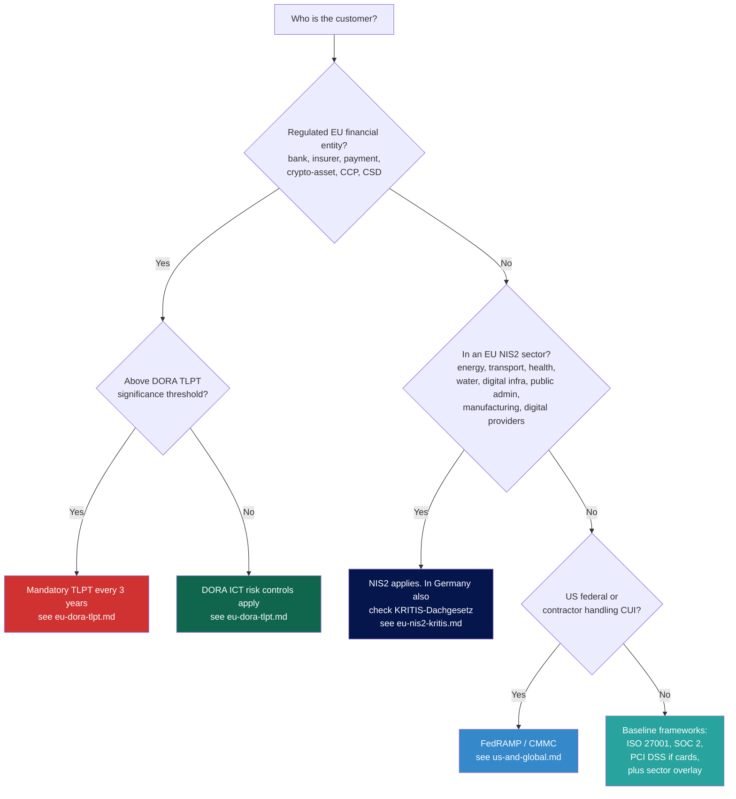

# 01 — Standards & Regulations

Which frameworks apply to whom, what they require, and how a cloud assessment proves compliance.

## Quick navigation

- **[EU DORA + TLPT + TIBER-EU](./eu-dora-tlpt.md)** — Financial sector, mandatory threat-led pentesting, applicable since Jan 2025.
- **[EU NIS2 + KRITIS](./eu-nis2-kritis.md)** — Critical infrastructure, broad scope, German implementation via NIS2UmsG (Dec 2025) and KRITIS-Dachgesetz (Mar 2026).
- **[US & Global Frameworks](./us-and-global.md)** — FedRAMP, SOC 2, HIPAA, PCI DSS, FFIEC CAT, NIST CSF/800-53.
- **[Sector Mapping](./sector-mapping.md)** — Which regulation hits which sector in which region.

## The overview matrix

Use this to identify what applies before scoping.

| Sector | EU | UK | US | Common cross-cutting |
|---|---|---|---|---|
| **Finance (banks, insurers, payment, crypto)** | DORA (TLPT) + NIS2 + GDPR + EBA Guidelines | CBEST, PRA SS1/21 | FFIEC CAT, GLBA, NYDFS 23 NYCRR 500, SEC Reg S-P | PCI DSS, SOC 2, ISO 27001 |
| **Health** | NIS2 + GDPR + EU MDR | DSPT, NHS DTAC | HIPAA, HITECH | ISO 27799, HITRUST |
| **Energy / Utilities / KRITIS** | NIS2 + KRITIS-Dachgesetz (DE) + NIS2 sector codes | NIS Regs 2018 (updated) | NERC CIP, TSA pipeline directives | ISA/IEC 62443 |
| **Telecoms** | EECC + NIS2 | Telecom Security Act 2021 | CISA TSA | ENISA telecom guidelines |
| **Government / Defense** | EU-CC, sector-specific | NCSC GovAssure, GCloud | FedRAMP, FISMA, CMMC, DISA SRG | NATO AC/35 |
| **Cloud Service Providers themselves** | EUCS (Cybersecurity Certification Scheme for Cloud) — draft | NCSC Cloud Principles | FedRAMP, StateRAMP | BSI C5 (DE), Cyber Essentials (UK), CSA STAR |

## Framework-to-control mapping

The platform audit checklists (`02-aws/audit-checklist.md`, `03-azure/audit-checklist.md`, `04-gcp/audit-checklist.md`) tag each check with its source standard ID so you can pull a control matrix from the same checklist for any of: CIS Benchmark, CSA CCM, ISO 27017/27018, NIST 800-53, PCI DSS, HIPAA Security Rule, BSI C5.

Mapping logic: CSA CCM is the most efficient pivot point. It maps cleanly to all the others. If you build your evidence library around CSA CCM control IDs, you can re-skin a report for any framework with minimal rework.

## Which standards every cloud assessor should have on the shelf

1. **CIS Benchmarks** for AWS, Azure (Foundations + AKS + Storage + Compute), GCP. Latest revisions, refreshed every ~12 months. Free.
2. **CSA Cloud Controls Matrix (CCM) v4.0**. Free with registration.
3. **ENISA Cloud Security Guide for SMEs** + **EUCS Candidate Scheme**. Free.
4. **NIST SP 800-204 series** (microservices, container, serverless security). Free.
5. **OWASP Cloud-Native Application Security Top 10** + **OWASP API Security Top 10 (2023)**.
6. **MITRE ATT&CK Cloud Matrix** (IaaS, Office 365, Google Workspace, Azure AD sub-matrices).
7. **BSI C5:2020** (Germany). For C5 audits on CSPs.
8. **BSI IT-Grundschutz Kompendium** — relevant modules: OPS.2.2 Cloud-Nutzung, APP.1.4 Mobile Apps, CON.8 Software-Entwicklung, SYS.1.6 Container.

## Standards that are mostly noise for offensive work

- ISO 27001 — too high-level to drive findings, but useful as the umbrella the customer reports against.
- COBIT — governance, not technical.
- NIST CSF — categories, not controls. Map your findings to its functions for executive reporting only.

## Quick decision tree

