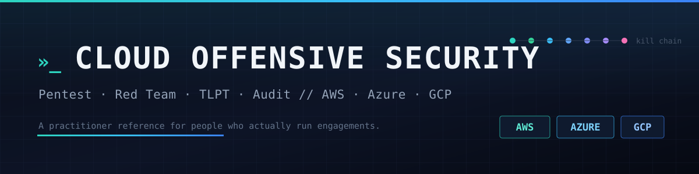
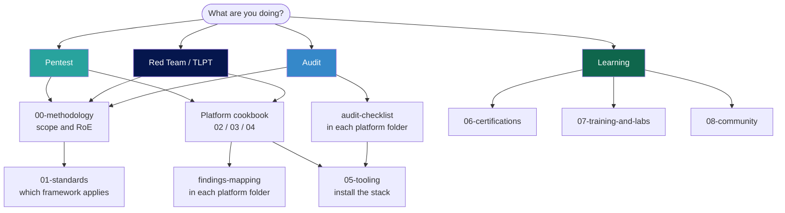

# Cloud Offensive Security


A practitioner's reference for cloud penetration testing, red teaming, and security audits across AWS, Azure, and GCP. Built for people who actually run engagements. Methodology, commands, findings mapping, regulatory context, and the resources worth your time.

If you do offensive cloud work for a living, this is the bookmark.

> **Authorization first.** Everything here is for systems you own or are explicitly authorized to test. See [Legal and authorization](#legal-and-authorization).

New here? Start with the [Glossary](./GLOSSARY.md) if the acronyms are unfamiliar, then pick your path in [How to use this repo](#how-to-use-this-repo).

---

## Repo at a glance

```
cloud-offensive-security/
├── README.md                        you are here
├── GLOSSARY.md                      every acronym in the repo, decoded
├── CONTRIBUTING.md                  how to contribute, house style
├── LICENSE                          CC BY-SA 4.0
├── assets/                          banner and graphics
├── 00-methodology/                  scoping, RoE, TLPT phases, reporting,
│                                       kill chain, MITRE ATT&CK mapping
├── 01-standards-and-regulations/    DORA, NIS2, KRITIS, US/global, sector matrix
├── 02-aws/                          cookbook + audit checklist + findings
├── 03-azure/                        cookbook + audit checklist + findings
├── 04-gcp/                          cookbook + audit checklist + findings
├── 05-tooling/                      tool catalog with install commands
├── 06-certifications/               three-tier cert guide
├── 07-training-and-labs/            labs, CTFs, training platforms
└── 08-community/                    people, blogs, podcasts, conferences
```

### Pick your path



---

## Full navigation

### 00 — Methodology
- [Overview](./00-methodology/README.md). Pentest vs red team vs audit scoping table, engagement-mode decision tree, TLPT 5 phases, rules of engagement checklist, the cloud kill chain, reporting structure.
- [MITRE ATT&CK Cloud mapping](./00-methodology/mitre-attack-cloud.md). Kill-chain-to-tactic crosswalk and technique tables to drop into reports.

### 01 — Standards and Regulations
- [Overview and decision tree](./01-standards-and-regulations/README.md)
- [EU DORA and TIBER-EU TLPT](./01-standards-and-regulations/eu-dora-tlpt.md). Articles 24-27, TIBER-EU phases, NCA list, cloud TLPT specifics.
- [EU NIS2 and German KRITIS](./01-standards-and-regulations/eu-nis2-kritis.md). Article 21, German NIS2UmsG, KRITIS-Dachgesetz.
- [US and global frameworks](./01-standards-and-regulations/us-and-global.md). FedRAMP, FISMA, CMMC, SOC 2, HIPAA, PCI DSS 4.0, UK CBEST, NIST CSF 2.0.
- [Sector mapping master matrix](./01-standards-and-regulations/sector-mapping.md). EU/UK/US/APAC by sector.

### 02 — AWS
- [Overview](./02-aws/README.md). AWS testing policy, scoping, tool stack.
- [Cookbook](./02-aws/cookbook.md). Full kill chain: recon, initial access, enum, privesc (21 paths), lateral, persistence, exfil.
- [Audit checklist](./02-aws/audit-checklist.md). CIS-aligned across IAM, logging, networking, EC2, Lambda, S3, RDS, KMS, EKS, Org.
- [Findings mapping](./02-aws/findings-mapping.md). F-AWS-* catalog with generic English finding template.

### 03 — Azure / Entra ID / M365
- [Overview](./03-azure/README.md). Entra/ARM/M365 distinction, Microsoft testing policy, tool stack.
- [Cookbook](./03-azure/cookbook.md). Recon (ROADtools), initial access (MFASweep, device code phish, TokenTacticsV2), enum (AzureHound, GraphRunner), privesc (Mollema/Bader CA bypass, KV abuse), lateral (AADConnect, AZUREADSSOACC$), persistence (FIC, federation), exfil.
- [Audit checklist](./03-azure/audit-checklist.md). CIS Azure Foundations v3 across Entra ID, Storage, Key Vault, NSG, VMs, AKS, SQL, Logging.
- [Findings mapping](./03-azure/findings-mapping.md). F-AZ-* catalog with English finding template (consent phishing example).

### 04 — GCP
- [Overview](./04-gcp/README.md). Org/folder/project model, SA-centric privesc, Google testing policy, tool stack.
- [Cookbook](./04-gcp/cookbook.md). Recon (GCPBucketBrute), initial access (leaked SA keys, metadata SSRF), enum (gcloud, testIamPermissions), privesc (Rhino's 30 paths), lateral (cross-project SA, DWD, GKE Workload Identity), persistence, exfil.
- [Audit checklist](./04-gcp/audit-checklist.md). CIS GCP Foundations v3 across IAM, GCS, Compute, GKE, SQL, Networking, KMS, Logging, SCC.
- [Findings mapping](./04-gcp/findings-mapping.md). F-GCP-* catalog with English finding template (Token Creator example).

### 05 — Tooling
- [Tool catalog](./05-tooling/README.md). Install commands and usage for the full stack: Pacu, CloudFox, Prowler v4, ScoutSuite, PMapper, Cloudsplaining, ROADtools, AzureHound, GraphRunner, MicroBurst, BARK, TokenTacticsV2, MFASweep, Maester, AADInternals, GCPBucketBrute, GCPHound, oauth2l, Stratus Red Team, CheckOV, steampipe, cartography, KubeHound, Peirates, trivy, trufflehog, gitleaks, noseyparker, gato-x, octoscan, zizmor.

### 06 — Certifications
- [Three-tier cert guide](./06-certifications/README.md). Management (CCSP, CCSK, SCS-C02, AZ-500, Google CSE), practitioner (SANS GCPN, eCPTX), advanced red team (Altered Security CARTP/CARTE/CRTP, Pwned Labs ACRTP/MCRTP/GCRTP/MCRTE). Includes DACH-specific notes and suggested sequencing.

### 07 — Training and Labs
- [Labs and training overview](./07-training-and-labs/README.md). Pwned Labs (Tyler Ramsbey), Altered Security (Nikhil Mittal), HackTheBox cloud tracks, CloudGoat (Rhino), AzureGoat, GCPGoat, IAM Vulnerable, Sadcloud, hackingthe.cloud, flAWS/flAWS2, fwd:cloudsec CTF, AWS GameDay. Suggested 6-12 month learning path.

### 08 — Community
- [People, blogs, conferences](./08-community/README.md). Dirk-jan Mollema, Fabian Bader, Nick Frichette, Christophe Tafani-Dereeper, Scott Piper, Andy Robbins, Karl Fosaaen, Beau Bullock, Gafnit Amiga, Shir Tamari, plus GitHub orgs, newsletters (CloudSecList, tl;dr sec), podcasts, conferences (fwd:cloudsec, TROOPERS, DEF CON Cloud Village).

---

## How to use this repo

**Running a pentest?** Start in [00-methodology](./00-methodology/README.md) for scoping, then drop into the platform cookbook ([AWS](./02-aws/cookbook.md), [Azure](./03-azure/cookbook.md), [GCP](./04-gcp/cookbook.md)). Map results to the platform's findings-mapping.md.

**Running an audit?** Same start, then use the audit checklist for your platform ([AWS](./02-aws/audit-checklist.md), [Azure](./03-azure/audit-checklist.md), [GCP](./04-gcp/audit-checklist.md)). Each check links to the CIS benchmark and CSA CCM control it satisfies.

**Running a red team or TLPT?** Start with [00-methodology](./00-methodology/README.md) and [eu-dora-tlpt.md](./01-standards-and-regulations/eu-dora-tlpt.md) if it's a regulated EU financial entity. Then platform cookbooks. Reporting under methodology.

**Setting up scope and regulatory context?** [01-standards-and-regulations](./01-standards-and-regulations/README.md) has the decision tree. Use the [sector matrix](./01-standards-and-regulations/sector-mapping.md) for the client's regulatory baseline.

**Learning?** Start with [06-certifications](./06-certifications/README.md) for a career path, [07-training-and-labs](./07-training-and-labs/README.md) for hands-on, [08-community](./08-community/README.md) for people whose research drives the field.

**Driving it with an AI agent (Hermes)?** This repo doubles as a Hermes skill. Read [SKILL.md](./SKILL.md) for the entry point and modes, and [NOTICE.md](./NOTICE.md) for the disclaimer and operator-responsibility terms. The agent must run every target-touching operation through `scripts/approval_gate.py` and stop for human approval on anything intrusive or destructive.

---

## Conventions

- Each cookbook follows the same kill-chain order: **Recon, Initial Access, Enumeration, Privilege Escalation, Lateral Movement, Persistence, Data Exfiltration**.
- Commands are **paste-ready**. Where a tool needs a token or credential, the variable name is consistent (`$TOKEN`, `$ACCESS_KEY`, `$SA_KEY`).
- Audit checks include the **CLI command**, the **expected secure state**, and the **finding ID** if it maps to a finding.
- Finding IDs follow `F-<PLATFORM>-<DOMAIN>-<NNN>`. PLATFORM is AWS, AZ, GCP, or MC (multi-cloud). DOMAIN is IAM, NET, LOG, etc.
- Regulatory references cite the article/clause and the latest applicable version as of mid-2026.

---

## Legal and authorization

What this repo **is**: a working playbook for assessing cloud environments you have authorization to test.

What it **isn't**: a tutorial on cloud fundamentals, a substitute for a real engagement letter, or a guide for testing things you don't own.

The techniques here are for **authorized** security testing only. Before running anything against a live environment you need: a signed engagement letter or scope agreement, the cloud provider's testing policy satisfied (AWS, Azure, and GCP each publish one), and the target accounts/subscriptions/projects explicitly in scope. Authorization is on you. The authors and contributors accept no liability for misuse.

## Contributing

PRs welcome. See [CONTRIBUTING.md](./CONTRIBUTING.md) for the house style and finding-ID convention. In short: commands first, prose second, no marketing, cite your sources, and use Mermaid over images for diagrams.

## Companion: findings catalog

The cloud-specific finding categories (descriptive, generic, ready to drop into any pentest finding repository) live in a separate `findings-catalog`. Keep it alongside this repo or merge it into a platform `findings-mapping.md`, whichever fits your workflow.

## License

This repository is licensed under [CC BY-SA 4.0](./LICENSE). You may share and adapt the material, including commercially, with attribution and under the same license. Third-party tools and external resources referenced here remain under their own licenses.
